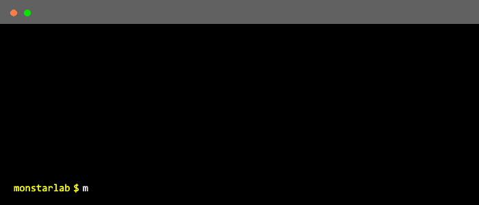

# Monstarlab Flutter Bricks 🧱

A collection of useful bricks by Monstarlab.

## Installation

Ensure you have the [mason_cli](https://github.com/felangel/mason/tree/master/packages/mason_cli) installed.

```sh
# 🎯 Activate from https://pub.dev
dart pub global activate mason_cli
```

```sh
# 🍺 Or install from https://brew.sh
brew tap felangel/mason
brew install mason
```

To ensure that you have mason installed in your system, run `mason` on your terminal.

```sh
mason
```

You should see something similar.

```sh
🧱  mason • lay the foundation!
...
```

Initiate the mason by running the following command:

```sh
# Initiate the mason
mason init
```

This command should create a file named `mason.yaml`.

In your project include these in `mason.yaml`.

```sh
bricks:
  # service brick
  service:
    git:
      url: "https://github.com/monstar-lab-oss/flutter-bricks.git"
      path: bricks/service

  # usecase brick
  usecase:
    git:
      url: "https://github.com/monstar-lab-oss/flutter-bricks.git"
      path: bricks/usecase

  # feature brick
  feature:
    git:
      url: "https://github.com/monstar-lab-oss/flutter-bricks.git"
      path: bricks/feature
```

## Bricks

| Brick     | Description                               |
| --------- | ----------------------------------------- |
| `service` | Generate a new service (data and domain)  |
| `usecase` | Generate a new usecase (domain)           |
| `feature` | Generate a new feature (ui, cubits, etc.) |

> _⚠️ You must have Dart 3.0 or up to use new language features._

## Usage

If you have `mason.yaml` in place just run the following commands to start using:

```sh
# 🎯 To get all mason bricks from mason.yaml
mason get
```

Now you are ready to go! Each time you modify this `brick.yaml`, we need to run this `mason get` command.

For example, if you want to make a feature in your project —

```sh
# 🚀 To make a feature from mason brick template
mason make feature
```



<br/>

Also, make sure you add these lines to your `.gitignore` file if you are using git in your project.

```sh
# Local Mason Files
.mason/
mason-lock.json
```
